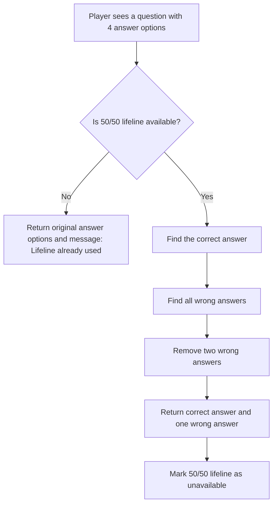

# EXP-2026-05-14 Pure Function Experiment

## Project

Millionaire Quiz

## Feature

50/50 Lifeline

## Goal of Experiment

The goal of this experiment was to test whether an AI assistant can generate clean logic for the 50/50 lifeline feature when it receives BDD requirements and a Mermaid flow diagram.

The feature must be implemented as a pure function. It should not use GUI, database, files, global variables, or random behavior.

## Prompt Provided to AI

I am working on a Python Tkinter + SQLite project called Millionaire Quiz.

Feature: 50/50 Lifeline

User Story:
As a player, I want to use a 50/50 lifeline during the quiz, so that two wrong answer options are removed and I have a better chance to choose the correct answer.

Acceptance Criteria:

AC1:
Given the current question has four answer options and one correct answer
When the player uses the 50/50 lifeline
Then two incorrect answer options are removed and the correct answer remains visible

AC2:
Given the player has not used the 50/50 lifeline yet
When the player activates the 50/50 lifeline
Then the lifeline becomes unavailable for the rest of the game

AC3:
Given the current question has one correct answer and three wrong answer options
When the 50/50 lifeline is applied
Then the correct answer must stay in the returned answer options

Mermaid flow:



Task:
Write the logic for this feature as a Pure Function.
It must have no side effects, must be stateless, and must return a predictable output.
Use Python.
Do not use database, GUI, random module, file writing, or global variables.

## AI Output

The AI generated the following Python function:

```python
def apply_5050_lifeline(options, correct_answer, lifeline_available):
    if not lifeline_available:
        return {
            "visible_options": options,
            "lifeline_available": False,
            "message": "50/50 lifeline has already been used."
        }

    if correct_answer not in options or len(options) != 4:
        return {
            "visible_options": options,
            "lifeline_available": lifeline_available,
            "message": "Invalid question data."
        }

    wrong_answers = [option for option in options if option != correct_answer]

    if len(wrong_answers) < 3:
        return {
            "visible_options": options,
            "lifeline_available": lifeline_available,
            "message": "Invalid answer options."
        }

    visible_options = [correct_answer, wrong_answers[0]]

    return {
        "visible_options": visible_options,
        "lifeline_available": False,
        "message": "50/50 lifeline used successfully."
    }
```

## Did the AI Succeed on the First Try?

Mostly yes. The AI generated a function that follows the main requirements. It keeps the correct answer, removes two wrong answers, and updates the lifeline status in the returned result.

## Is It a Pure Function?

Yes. The function can be considered pure because:

- it does not use database
- it does not update the GUI
- it does not write to files
- it does not use global variables
- it does not use random values
- it returns the same output for the same input

## Did Requirements Need Adjustment?

A small adjustment was needed. In a real game, the removed wrong answers could be random. However, for this experiment, random behavior was avoided because the task required predictable output.

Because of this, the function keeps the correct answer and the first wrong answer from the list.

## Conclusion

This experiment showed that BDD requirements and Mermaid diagrams help AI generate more controlled and understandable code.

The pure function approach is useful because the logic can be tested separately before connecting it to the Tkinter interface and SQLite database.

For the Millionaire Quiz project, this method can help reduce mistakes and make the code easier to maintain.
